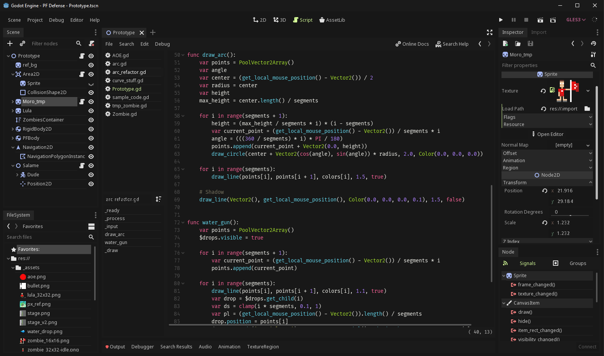

+++
author = "leandro"
title = "Godot engine 3.1 theme tweaks"
slug = "godot-31-theme-tweaks"
date = 2019-02-13T18:29:55-02:00
description = "O que fazer para deixar o seu Godot ainda mais lindão?!"
tags = ['tips', 'godot', 'gamedev']
draft = false
images = [
    "https://xupisco.github.io/img/zen.png",
]
+++

Então, como já devem ter percebido eu não curto nada "default" e acabo sempre fazendo alguma customização dos apps que uso, seja de interface, cores, fonts, etc... Muito difícil me agradar "out-of-the-box".

Por isso estou compartilhando abaixo o que fiz de alterações no [Godot Engine][1] (versão 3.1) para ficar lindão... XD - Veja só!

[][2]
*Você sabia que pode clicar para ver maior?! Oo*

### Da hora, o que vc fez? ###
Segue abaixo o que foi alterado... na verdade, nem é muita coisa:

```
Menu > Editor > Editor Settings:
 - Interface > Theme:
   - Base Color: #1a1a1a
   - Accent Color: #d4fa97
   - Contrast: 0.07
   - Highligh Tabs: On
   - Border Size: 0
   - Graph Node Headers: On
   - Additional Spacing: 0.5
   - Highlight Color: #d49de5
```

Para o editor de textos (syntax-highlight), estou usando o [Monokai][3] com duas pequenas customizações:

```
background_color="ff181818"
current_line_color="ff282828"
```

Pois é, só isso... já está usando o [Godot Engine][1]?  
Deveria!


[1]: https://godotengine.com.br
[2]: ../../static/img/posts/godot_31.png
[3]: https://github.com/Calinou/godot-syntax-themes
