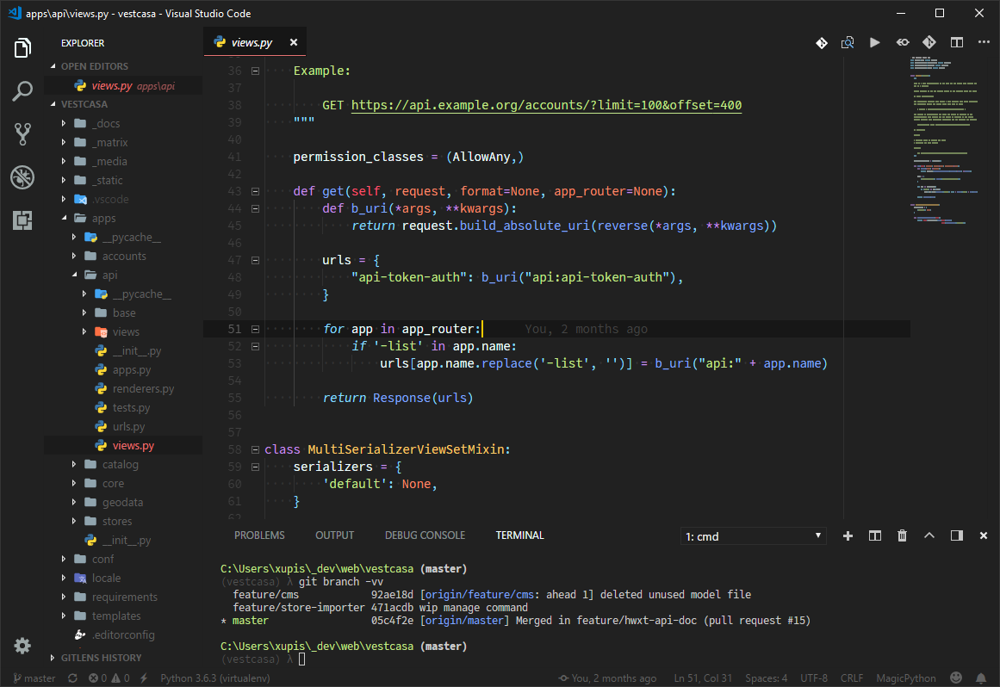
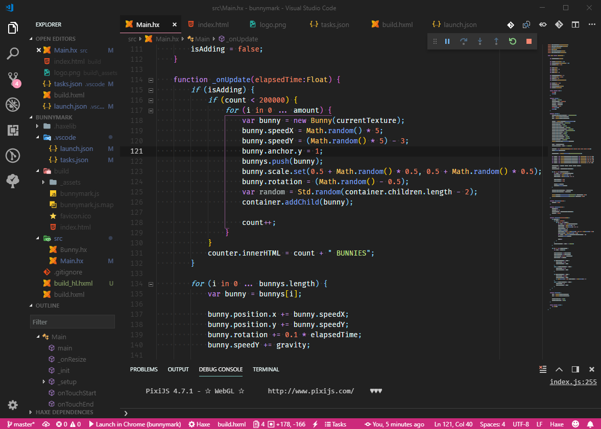

+++
author = "leandro"
title = "Minhas extensões e configurações do VSCode"
slug = "minhas-extensoes-e-configuracoes-do-vscode"
date = 2019-02-12T19:29:30-03:00
description = "Uma geral sobre as extensões, tema e configurações que uso atualmente no VSCode."
tags = ['vscode', 'tips']
draft = false
images = [
    "https://xupisco.net/img/zen.png",
]
+++

Bom, acho que todo mundo já conhece o VSCode, certo? Mas em resumo, é um editor de texto "[open-source](https://github.com/Microsoft/vscode)" criado pelo Microsoft e hoje em dia é o queridinho dos developers.

> Fun fact: O VSCode é atualmente o [11º projeto](https://github.com/search?p=2&q=stars%3A%3E1&s=stars&type=Repositories) com mais "stars" no GitHub.

Confesso que gosto muito do editor que além de rápido é 100% customizável (temas e extensions), o que quero contar aqui é quais são as minhas extensões atuais, tema e configurações (settings), sem mais delongas:


*Um projeto em Python/Django... suporte total!*


*Agora bincando com Haxe e Heaps...debug ligado!*

## Extensions
Abaixo um quick-list de todas que tenho instaladas, em ordem alfabética, uma pequena descrição e link para o Marketplace...

**[Auto Close Tag][1]**  
Fecha automaticamente as tags abertas, qq uma...basta fechar com p 'qqtag>' que ele coloca o </ qqtag> depois.

**[Auto Rename Tag][2]**  
Renomeia automaticamente o final da tag editada.

**[Awesome Flutter Snippets][3]**  
Coleção de snippets e atalhos para as funções e classes mais utilizadas no Flutter. (ainda não conhece o [Flutter](https://flutter.io)?)

**[Better TOML][4]**  
Suporte e color-highlight para arquivos TOML.

**[Bracket Pair Colorizer][5]**  
Esse cara é ninja, além de colocar cada parênteses, chaves, etc... em uma cor diferente (correspondente) ele mostra onde está o começo e o fim do caracter! Recomendo muito.


**[C/C++][6]**  
Suporte para C/C++, color highlight, snippets, etc... (para quando estou brincando com C++)

**[C#][7]**  
Suporte para C#, color highlight, snippets, etc... (para as aventuras em Unity)

**[Dart][8]**  
Suporte para C#, color highlight, snippets, etc... (quando preciso do Flutter)

**[Debugger for Chrome][9]**  
Com ele é possível "debugar" apps em JS direto pelo VSCode, funciona que é uma beleza.

**[Debugger for Unity][10]**  
Como o nome diz, ele faz o "attach" do Unity com o VSCode para poder fazer o debug do C#.

**[Djaneiro][11]**  
Coleção de funcionalidades para Django / Python.

**[Flutter][12]**  
Suporte ao Framework Flutter, syntax-highlight e alguns snipplets.

**[Git History][13]**  
Mostra o histórico do GIT para arquivos individuais ou repo, muito bom.

**[Git Indicators][14]**  
Mostra no "gutter" o estado das alterações atuais do arquivo comparado com seu último commit.

**[GitLens][15]**  
Uma verdadeira lente de aumento para visualização do seu repositório.

**[Godot Tools][16]**  
Suporte ao GDScript, syntax-highlight e alguns snipplets.

**[HashLink Debugger][17]**  
Debug para o Hashlink compiler (Haxe).

**[Haxe][18]**  
Suporte a linguagem Haxe, syntax-highlight e alguns snipplets.

**[highlight-matching-tag][19]**  
Este cara coloca um "underline" no fechamento da tag correspondente.

**[HTML Boilerplate][20]**  
Tem uns "skeletons" para novos arquivos em HTML.

**[Image Preview][21]**  
Mostra um thumb no gutter da imagem que está no src.

**[IntelliSense for CSS][22]**  
Melhora o intellisense de CSS de maneira geral para o projeto / workspace.

**[Love2D][23]**  
Suporte ao Framework Love2D, syntax-highlight e alguns snipplets.

**[Lua][24]**  
Suporte a linguagem LUA, syntax-highlight e alguns snipplets.

**[Lua Plus][25]**  
Essa extension "melhora" um pouco a anterior... trazendo mais syntax-highlight além de um auto-complete para tabelas, etc.

**[Markdown PDF][27]**  
Salva documentos em markdown em PDF.

**[Markdown Preview Enhanced][28]**  
Cria uma janela side-by-side com o render do markdown em tempo real, este post foi escrito usando ele.

**[Markdown Preview Mermaid][29]**  
Suporte ao Mermaid JS no markdown, para criação de gráficos e charts.

**[Markdown Shortcuts][30]**  
Suporte a shortcuts simples no markdown como negrito, link, etc...

**[Material Icon Theme][31]**  
Muda os ícones dos arquivos e pastas.

**[Material Theme][32]**  
Tema.

**[One Dark Pro][33]**  
Tema.

**[p5js Snippets][34]**  
Suporte ao Framework P5js, syntax-highlight e alguns snipplets.

**[Path Intellisense][35]**  
Faz o auto-complete de pastas (folders) no código.

**[Python][36]**  
Rá.

**[Quick Task][37]**  
Permite executar suas tasks de maneira rápida pela barra de status.

**[Settings Sync][38]**  
Faz o publish das suas settings e extencions em um Gist, muito útil se vc tem mais de um computador.

**[Shader Language Support][39]**  
Suporte a linguagem OpenGL, syntax-highlight e alguns snipplets.

**[Shader Toy][40]**  
Faz um previu do seu shader dentro do VSCode.

**[TODO Highlight][41]**  
Ele coloca uma corzinha nos "todos" que encontrar no seu código.

**[Todo Tree][42]**  
Coloca um ícone na action-bar que faz um overview de todos seus "todos" no workspace.

**[Unity Snippets][43]**  
Suporte ao Unity (C#), syntax-highlight e alguns snipplets.

**[Unity Tools][44]**  
Mesmo do anterior... só que diferente! :)

**[Vetur][45]**  
Suporte ao Framework VUE.js, syntax-highlight e alguns snipplets.

**[vscode-icons][46]**  
Muda os ícones dos arquivos e pastas

## Theme / Settings

Bom, aqui o negócio é tenso... hahaah! Na íntegra o meu settings.json, muito "fine-tune" na customização do tema e alguns outros tweaks, se tiver dúvida com algum parametro, comenta ae...

**source: settings.json**
```json
{
    "workbench.colorTheme": "Material Theme Darker High Contrast",
    "workbench.iconTheme": "material-icon-theme",
    "editor.fontFamily": "Fira Code, Office Code Pro, Hack, Consolas, 'Courier New', monospace",
    "editor.fontSize": 14,
    "editor.lineHeight": 20,
    "terminal.integrated.shell.windows": "C:\\WINDOWS\\System32\\cmd.exe",
    "window.zoomLevel": 0,
    "editor.renderControlCharacters": true,
    "editor.codeLens": false,
    "markdown.preview.fontSize": 15,
    "files.hotExit": "off",
    "files.exclude": {
        "**/*.pyc": true
    },
    "extensions.autoUpdate": false,
    "editor.autoIndent": true,
    "markdown-preview-enhanced.previewTheme": "github-light.css",
    "sync.gist": "14ca04088a1796058ac47d48ca6df3db",
    "sync.autoDownload": false,
    "sync.autoUpload": false,
    "sync.forceDownload": false,
    "sync.quietSync": false,
    "sync.askGistName": false,
    "window.restoreWindows": "none",
    "C_Cpp.intelliSenseEngine": "Default",
    "terminal.integrated.fontSize": 12,
    "terminal.integrated.fontFamily": "Office Code Pro, Hack, Consolas, 'Courier New', monospace",
    "terminal.integrated.shellArgs.windows": [
        "/K",
        "<CMDER_PATH>\\vscode.bat"
    ],
    "terminal.integrated.cursorBlinking": true,
    "editor.minimap.renderCharacters": false,
    "editor.renderLineHighlight": "all",
    "editor.showFoldingControls": "always",
    "markdown-preview-enhanced.mermaidTheme": "dark",
    "workbench.colorCustomizations": {
        "panel.border": "#fff0",
        "scrollbar.shadow": "#fff0",
        "activityBar.border": "#fff0",
        "tab.border": "#fff0",
        "sideBar.border": "#0000",
        "sideBarSectionHeader.border": "#0000",
        "titleBar.border": "#0000",
        "contrastActiveBorder": "#0000",
        "contrastBorder": "#fff0",
        "editorGroup.border": "#fff0",
        "tab.activeBackground": "#212121",
        "tab.inactiveBackground": "#1a1a1a",
        "tab.unfocusedActiveBorder": "#0000",
        "editorGroupHeader.tabsBackground": "#1a1a1a",
        "editorHoverWidget.border": "#fff0",
        "editorWhitespace.foreground": "#333",
        "dart.closingLabels": "#ffffff25",
        "activityBarBadge.background": "#f36192",
        "activityBar.foreground": "#fff",
        "activityBar.inactiveForeground": "#666",
        "list.activeSelectionForeground": "#fa97b8",
        "list.inactiveSelectionForeground": "#fa97b8",
        "list.highlightForeground": "#fa97b8",
        "editorSuggestWidget.highlightForeground": "#fa97b8",
        "textLink.foreground": "#fa97b8",
        "progressBar.background": "#fa97b8",
        "pickerGroup.foreground": "#fa97b8",
        "tab.activeBorder": "#fff0",
        "notificationLink.foreground": "#fa97b8",
        "notificationCenterHeader.foreground": "#fff",
        "notificationCenterHeader.background": "#222",
        "notifications.background": "#222222",
        "notifications.foreground": "#ccc",
        "notificationToast.border": "#0000",
        "notifications.border": "#0000",
        "editorWidget.border": "#fa97b8",
        "editorRuler.foreground": "#303030",
        "badge.foreground": "#aaa",
        "editorSuggestWidget.border": "#fff0",
        "editorSuggestWidget.background": "#161616",
        "editorSuggestWidget.foreground": "#eee",
        "editorSuggestWidget.selectedBackground": "#252525",
        "editorHoverWidget.background": "#161616",
        "editorWidget.background": "#161616",
        "editorLineNumber.activeForeground": "#cccccc",
        "editor.lineHighlightBackground": "#191919",
        "scrollbarSlider.background": "#02020241",
        "scrollbarSlider.activeBackground": "#FF408150",
        "scrollbarSlider.hoverBackground": "#151515",
        "statusBar.debuggingBackground": "#cc297b",
        "statusBar.debuggingBorder": "#222",
        "menu.background": "#181818",
        "menu.selectionBackground": "#cc297b",
        "menu.selectionForeground": "#fff",
        "debugToolBar.background": "#333",
        "statusBarItem.hoverBackground": "#151515",
        "statusBarItem.activeBackground": "#000",
        "statusBar.border": "#fff0",
        "list.inactiveSelectionBackground": "#fff0",
        "activityBarBadge.foreground": "#fff",
        "peekViewEditor.background": "#191919",
        "peekViewEditorGutter.background": "#191919",
        "peekViewResult.background": "#191919",
        "peekViewTitle.background": "#191919",
        "peekViewResult.selectionBackground": "#101010",
        "peekViewResult.selectionForeground": "#fa97b8",
        "peekView.border": "#0000",
        "breadcrumb.foreground": "#eee",
        "breadcrumb.focusForeground": "#fa97b8",
        "breadcrumb.activeSelectionForeground": "#fa97b8",
        "editorWidget.resizeBorder": "#cc297b",
        "settings.modifiedItemIndicator": "#85e485",
        "settings.headerForeground": "#fa97b8",
        "panelTitle.activeBorder": "#cc297b",
        "menubar.selectionForeground": "#fa97b8",
        "sideBarSectionHeader.foreground": "#eee",
        "editorGroupHeader.tabsBorder": "#fff0",
    },
    "editor.tokenColorCustomizations": {
        "comments": "#ffffff30"
    },
    "window.menuBarVisibility": "toggle",
    "editor.renderWhitespace": "boundary",
    "workbench.activityBar.visible": true,
    "editor.multiCursorModifier": "ctrlCmd",
    "markdown-preview-enhanced.revealjsTheme": "black.css",
    "editor.minimap.enabled": true,
    "editor.hideCursorInOverviewRuler": true,
    "editor.rulers": [
        80,
        90
    ],
    "git.enableSmartCommit": true,
    "window.title": "${dirty}${activeEditorMedium}${separator}${rootName}${separator}${appName}",
    "emmet.includeLanguages": {
        "django-template": "html"
    },
    "workbench.startupEditor": "none",
    "gitlens.advanced.messages": {
        "suppressCommitHasNoPreviousCommitWarning": false,
        "suppressCommitNotFoundWarning": false,
        "suppressFileNotUnderSourceControlWarning": false,
        "suppressGitVersionWarning": false,
        "suppressLineUncommittedWarning": false,
        "suppressNoRepositoryWarning": false,
        "suppressResultsExplorerNotice": false,
        "suppressShowKeyBindingsNotice": true,
        "suppressUpdateNotice": false,
        "suppressWelcomeNotice": true
    },
    "gitlens.codeLens.scopes": [
        "document",
        "containers"
    ],
    "gitlens.currentLine.format": "${authorAgo}",
    "[dart]": {
        "editor.tabSize": 2,
        "editor.insertSpaces": true
    },
    "gitlens.keymap": "chorded",
    "dart.closingLabels": true,
    "git.autofetch": true,
    "sync.removeExtensions": true,
    "sync.syncExtensions": true,
    "python.linting.pylintArgs": [
        "--load-plugins=pylint_django"
    ],
    "auto-close-tag.activationOnLanguage": [
        "xml",
        "php",
        "blade",
        "ejs",
        "jinja",
        "javascript",
        "javascriptreact",
        "typescript",
        "typescriptreact",
        "plaintext",
        "markdown",
        "vue",
        "liquid",
        "erb",
        "lang-cfml",
        "cfml",
        "HTML (Eex)",
        "django-html"
    ],
    "editor.occurrencesHighlight": false,
    "editor.fontLigatures": true,
    "editor.scrollBeyondLastLine": false,
    "editor.smoothScrolling": true,
    "editor.detectIndentation": false,
    "editor.acceptSuggestionOnCommitCharacter": false,
    "GodotTools.editorPath": "<GODOT_PATH>\\Godot_v3.0.6-stable_win64.exe",
    "breadcrumbs.enabled": true,
    "window.titleBarStyle": "custom",
    "workbench.editor.enablePreviewFromQuickOpen": false,
    "workbench.editor.enablePreview": false,
    "todo-tree.defaultHighlight": {
        "foreground": "green",
        "type": "none"
    },
    "todo-tree.customHighlight": {
        "TODO": {},
        "FIXME": {},
        "FIX": {}
    },
    "shader-toy.reloadOnChangeEditor": true,
    "pixelbyte.love2d.path": "<LOVE2D_PATH>\\love.exe",
    "editor.tabCompletion": "on",
    "[python]": {},
    "gitlens.views.repositories.files.layout": "tree",
    "gitlens.views.fileHistory.enabled": true,
    "gitlens.views.lineHistory.enabled": true,
    "material-icon-theme.folders.color": "#90a4ae",
    "breadcrumbs.filePath": "off",
    "materialTheme.accent": "Pink",
    "files.trimTrailingWhitespace": true,
    "workbench.statusBar.feedback.visible": false,
    "liveshare.showInStatusBar": "whileCollaborating",
}
```


[//]: Links

[1]: https://marketplace.visualstudio.com/items?itemName=formulahendry.auto-close-tag
[2]: https://marketplace.visualstudio.com/items?itemName=formulahendry.auto-rename-tag
[3]: https://marketplace.visualstudio.com/items?itemName=Nash.awesome-flutter-snippets
[4]: https://marketplace.visualstudio.com/items?itemName=bungcip.better-toml
[5]: https://marketplace.visualstudio.com/items?itemName=CoenraadS.bracket-pair-colorizer
[6]: https://marketplace.visualstudio.com/items?itemName=ms-vscode.cpptools
[7]: https://marketplace.visualstudio.com/items?itemName=ms-vscode.csharp
[8]: https://marketplace.visualstudio.com/items?itemName=Dart-Code.dart-code
[9]: https://marketplace.visualstudio.com/items?itemName=msjsdiag.debugger-for-chrome
[10]: https://marketplace.visualstudio.com/items?itemName=Unity.unity-debug
[11]: https://marketplace.visualstudio.com/items?itemName=Unity.unity-debug
[12]: https://marketplace.visualstudio.com/items?itemName=Dart-Code.flutter
[13]: https://marketplace.visualstudio.com/items?itemName=donjayamanne.githistory
[14]: https://marketplace.visualstudio.com/items?itemName=lamartire.git-indicators
[15]: https://marketplace.visualstudio.com/items?itemName=eamodio.gitlens
[16]: https://marketplace.visualstudio.com/items?itemName=geequlim.godot-tools
[17]: https://marketplace.visualstudio.com/items?itemName=HaxeFoundation.haxe-hl
[18]: https://marketplace.visualstudio.com/items?itemName=nadako.vshaxe
[19]: https://marketplace.visualstudio.com/items?itemName=vincaslt.highlight-matching-tag
[20]: https://marketplace.visualstudio.com/items?itemName=sidthesloth.html5-boilerplate
[21]: https://marketplace.visualstudio.com/items?itemName=kisstkondoros.vscode-gutter-preview
[22]: https://marketplace.visualstudio.com/items?itemName=Zignd.html-css-class-completion
[23]: https://marketplace.visualstudio.com/items?itemName=pixelbyte-studios.pixelbyte-love2d
[24]: https://marketplace.visualstudio.com/items?itemName=keyring.Lua
[25]: https://marketplace.visualstudio.com/items?itemName=jep-a.lua-plus
[26]: https://marketplace.visualstudio.com/items?itemName=magicstack.MagicPython
[27]: https://marketplace.visualstudio.com/items?itemName=yzane.markdown-pdf
[28]: https://marketplace.visualstudio.com/items?itemName=shd101wyy.markdown-preview-enhanced
[29]: https://marketplace.visualstudio.com/items?itemName=bierner.markdown-mermaid
[30]: https://marketplace.visualstudio.com/items?itemName=bierner.markdown-mermaid
[31]: https://marketplace.visualstudio.com/items?itemName=PKief.material-icon-theme
[32]: https://marketplace.visualstudio.com/items?itemName=Equinusocio.vsc-material-theme
[33]: https://marketplace.visualstudio.com/items?itemName=zhuangtongfa.Material-theme
[34]: https://marketplace.visualstudio.com/items?itemName=acidic9.p5js-snippets
[35]: https://marketplace.visualstudio.com/items?itemName=christian-kohler.path-intellisense
[36]: https://marketplace.visualstudio.com/items?itemName=ms-python.python
[37]: https://marketplace.visualstudio.com/items?itemName=lkytal.quicktask
[38]: https://marketplace.visualstudio.com/items?itemName=Shan.code-settings-sync
[39]: https://marketplace.visualstudio.com/items?itemName=slevesque.shader
[40]: https://marketplace.visualstudio.com/items?itemName=stevensona.shader-toy
[41]: https://marketplace.visualstudio.com/items?itemName=wayou.vscode-todo-highlight
[42]: https://marketplace.visualstudio.com/items?itemName=Gruntfuggly.todo-tree
[43]: https://marketplace.visualstudio.com/items?itemName=YclepticStudios.unity-snippets
[44]: https://marketplace.visualstudio.com/items?itemName=Tobiah.unity-tools
[45]: https://marketplace.visualstudio.com/items?itemName=octref.vetur
[46]: https://marketplace.visualstudio.com/items?itemName=robertohuertasm.vscode-icons

---
E ae? Como está o seu VSCode?  
Hugs...